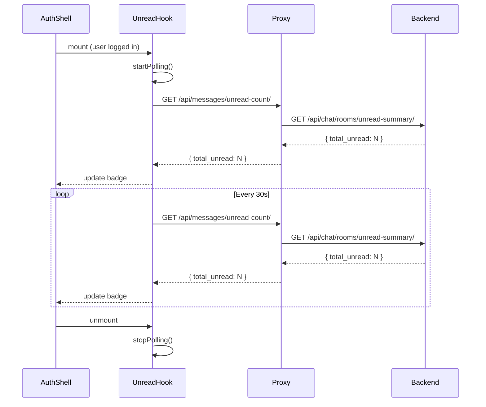

# Messaging Realtime Strategy

## Current Approach: REST Polling

The frontend uses REST polling for the unread count badge in the navigation sidebar. Messages are fetched on demand when the user opens a conversation.

### Polling Configuration

| Parameter | Value |
|---|---|
| Endpoint | `GET /api/messages/unread-count/` |
| Interval | 30 seconds |
| Start | On `AuthShell` mount (user authenticated) |
| Stop | On `AuthShell` unmount (navigation away, logout) |
| Error handling | Silent fail (no retry) |
| Tab visibility | Not paused when hidden |

### Polling Behavior

## Backend WebSocket (Available, Not Consumed Frontend)

The Django backend has a WebSocket consumer (`chat/consumers.py`) that can push real-time events. The frontend does not currently use it.

### Why Not WebSocket Frontend

- **Complexity**: WebSocket connection management, reconnection, auth sync add significant complexity.
- **Adequate polling**: 30-second polling is sufficient for the unread badge.
- **Mobile-friendly**: REST polling works reliably on mobile networks where WebSockets may drop.
- **Phase boundary**: WebSocket frontend integration is deferred to a future phase.

## Future: WebSocket Frontend Integration

When implemented, the WebSocket frontend would:

1. Connect to Django Channels WebSocket on login.
2. Receive real-time message events.
3. Update unread count without polling.
4. Show new messages in real-time when conversation is open.
5. Handle reconnection with exponential backoff.
